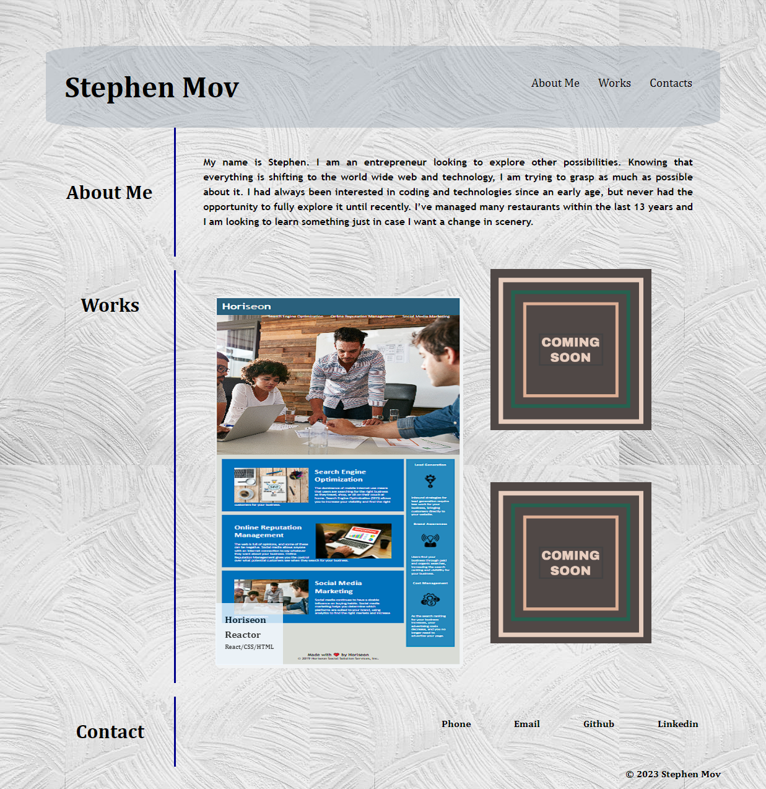

# stephen-portfolio

## Description

This assignment allowed me to create my first site. The website will be something I will continue to touch up on and feel comfortable to show to future companies to show case some of the projects I've completed. I haven't done any amazing project yet, so I will just showcase the first week assignment and plans on replacing it in the future. In this site, I wrote a little description about myself, and created different types of links to contact me. Creating this website was a challange and helps me improves and touch up my CSS and HTML knowledges I learned in bootcamp.

### Usage / Screenshot

#### Website link
[Click here for live site](https://slmov215.github.io/stephen-portfolio/)
#### Contact
[Stephen Mov on GitHub](https://github.com/slmov215/stephen-portfolio)
### License
Refer to the license in the repo.

##### Thanks
Thanks to [Pexels.com](https://www.pexels.com/photo/white-painted-wall-1939485/) for allowing the use of the background image.